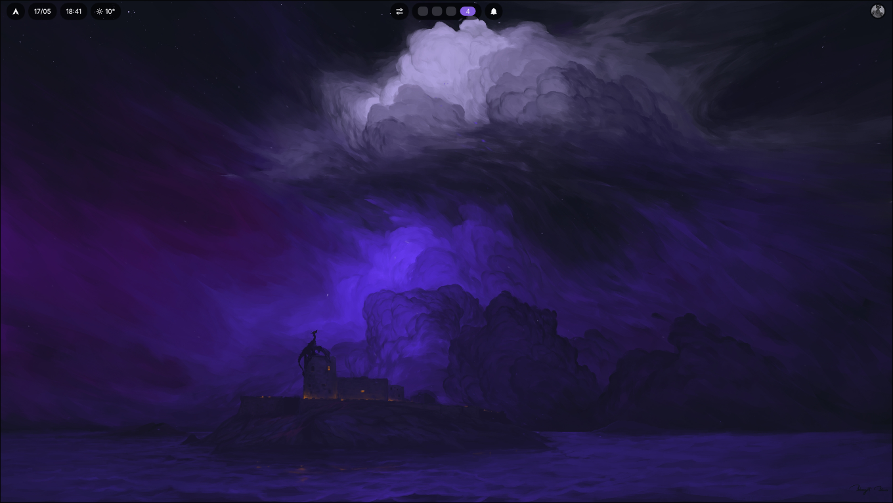

# Hyprbar

A custom status bar for Hyprland built with Rust, Wayland, SCTK, wgpu, Vello, and Parley.

The goal of this project is to build a clean, minimal, and maintainable desktop bar for a Wayland/Hyprland environment.

<p align="center">
  
</p>

## Features

- Wayland layer-shell top bar.
- GPU-based rendering with wgpu and Vello.
- Text rendering with Parley.
- Centralized theme and visual token system.
- Pill-based UI components.
- Date and clock pills.
- Weather pill using Open-Meteo with IP-based location detection.
- Hyprland workspace integration through IPC sockets.
- Workspace click handling.
- Workspace hover feedback.
- Dynamic accent colors loaded from `hyprcolors`.
- Static command center and notification pills.
- Profile avatar pill loaded from disk.
- Integration tests for parsers, layout, and hit testing.
- CI checks for formatting, tests, and Clippy warnings.

## Stack

- **Rust**: main language.
- **smithay-client-toolkit**: Wayland client abstractions and layer-shell support.
- **wayland-client**: low-level Wayland protocol interaction.
- **calloop**: event loop integration.
- **wgpu**: graphics backend.
- **vello**: 2D scene rendering.
- **parley**: text shaping and layout.
- **chrono**: date and time.
- **ureq**: weather API requests.
- **serde / serde_json**: typed JSON deserialization.
- **image**: profile avatar decoding and resizing.
- **anyhow**: application-level error handling.
- **env_logger**: logging.

## Project Structure

```txt
.
├── .github/
│   └── workflows/
│       └── ci.yml                 # Formatting, test, and Clippy checks
├── assets/
│   └── profile.jpeg               # Optional profile avatar image
├── src/
│   ├── lib.rs                     # Library crate exports
│   ├── main.rs                    # Binary entry point
│   ├── app.rs                     # Application module root
│   ├── hyprland_ipc.rs            # Hyprland IPC client
│   ├── app/
│   │   ├── input.rs               # Pointer interaction handling
│   │   ├── pointer.rs             # Pointer/cursor state
│   │   ├── render.rs              # App-level render pass
│   │   ├── runner.rs              # Application startup and main loop
│   │   ├── sources.rs             # calloop event sources
│   │   ├── state.rs               # AppState coordinator
│   │   ├── surface.rs             # Layer surface state
│   │   ├── surface_handle.rs      # Raw Wayland surface handle for wgpu
│   │   ├── wayland_state.rs       # Wayland/SCTK state grouping
│   │   └── worker.rs              # Background worker lifecycle helpers
│   ├── bar/
│   │   ├── layout.rs              # Left / center / right bar layout
│   │   ├── arch_logo_pill.rs
│   │   ├── clock_pill.rs
│   │   ├── command_center_pill.rs
│   │   ├── date_pill.rs
│   │   ├── notifications_pill.rs
│   │   ├── factory.rs             # Default bar composition
│   │   ├── profile/
│   │   │   ├── avatar.rs
│   │   │   └── pill.rs
│   │   ├── weather/
│   │   │   ├── config.rs
│   │   │   ├── fetcher.rs
│   │   │   ├── icons.rs
│   │   │   ├── mapper.rs
│   │   │   ├── pill.rs
│   │   │   └── state.rs
│   │   └── workspaces/
│   │       ├── geometry.rs
│   │       ├── listener.rs
│   │       ├── mapper.rs
│   │       ├── pill.rs
│   │       └── state.rs
│   ├── components/
│   │   ├── component.rs           # Component trait and interaction types
│   │   └── pill.rs                # Shared pill background
│   ├── render/
│   │   ├── context.rs             # wgpu + Vello render context
│   │   └── text.rs                # Parley + Vello text rendering
│   ├── theme/
│   │   ├── colors.rs              # Color palette
│   │   ├── hyprcolor.rs           # Dynamic colors from hyprcolors
│   │   ├── tokens.rs              # Spacing, sizing, radii, visual constants
│   │   └── typography.rs          # Font families and text sizes
│   └── wayland/
│       ├── handlers.rs            # SCTK trait implementations
│       ├── init.rs                # Wayland initialization
│       └── layer_surface.rs       # Layer-shell configuration
└── tests/
    ├── bar_layout.rs              # Layout and hit-test integration tests
    ├── weather_icons.rs
    ├── weather_mapper.rs
    └── workspaces_mapper.rs
```

## Architecture Rules

1. **Theme and tokens are the visual source of truth.**
   Colors, spacing, radii, sizing, icon scales, slot geometry, avatar border sizing, and notification dot sizing should live in `Theme` / `Tokens` whenever they describe visual design.

2. **Wayland setup stays inside the Wayland/app boundary.**
   Low-level Wayland and SCTK setup lives in `wayland/` and app state wrappers such as `wayland_state.rs`, `surface.rs`, and `surface_handle.rs`.

3. **UI elements implement `Component`.**
   Components expose:
   - `measure`: calculate intrinsic size.
   - `render`: draw inside the provided bounds.
   - `hit_test`: optionally report interactions for pointer handling.

4. **`Pill::draw` is the visual base for pill components.**
   Components draw the shared background first, then render their own content on top.

5. **`AppState` coordinates, but state is grouped by responsibility.**
   The Wayland event queue and calloop loop need a single shared state type, but internal state is grouped into smaller units such as pointer state, surface state, Wayland state, and render/UI state.

6. **Background threads must be owned.**
   Long-running workers should be represented by `WorkerHandle` and receive a shutdown token instead of being detached forever.

7. **External JSON should be deserialized into typed structs.**
   Parsers should avoid ad-hoc `serde_json::Value` navigation unless there is a clear reason.

8. **Measured and rendered data should be frame-consistent.**
   Components that read changing data should avoid measuring one value and rendering another within the same frame.

## Requirements

- Linux.
- A Wayland compositor with `wlr-layer-shell` support.
- Hyprland (recommended).
- Rust stable with edition 2024 support.
- Fonts:
  - `Inter` or a compatible fallback.
  - `Symbols Nerd Font` for icons.

## Running

```sh
cargo run
```

For a release build:

```sh
cargo run --release
```

Enable logs with:

```sh
RUST_LOG=info cargo run
```

For more detailed Hyprland event logs:

```sh
RUST_LOG=debug cargo run
```

## Quality Checks

Run the same checks used by CI:

```sh
cargo fmt --all -- --check
cargo test --all-targets --all-features
cargo clippy --all-targets --all-features -- -D warnings
```

Or during local development:

```sh
cargo fmt
cargo test
cargo clippy -- -D warnings
```

## Assets

The profile pill currently tries to load:

```txt
assets/profile.jpeg
```

If the image is missing or cannot be decoded, the bar falls back to a simple placeholder circle.

## Dynamic Colors

Hyprbar can load dynamic colors generated by `hyprcolors`.

Expected file:

```txt
$XDG_CACHE_HOME/hyprcolors/colors.json
```

Fallback path when `XDG_CACHE_HOME` is not set:

```txt
~/.cache/hyprcolors/colors.json
```

Expected fields:

```json
{
  "accent": "#9a8cff",
  "foreground": "#f5f5f7"
}
```

The accent color is used by the active workspace slot and other accent-driven UI elements.

## Hyprland IPC

Hyprbar talks to Hyprland directly through its Unix sockets.

Hyprland exposes sockets under:

```txt
$XDG_RUNTIME_DIR/hypr/$HYPRLAND_INSTANCE_SIGNATURE/
```

Used sockets:

- `.socket.sock`: request/response queries and dispatches.
- `.socket2.sock`: event stream.

The IPC client uses timeouts for request/response calls and event stream reads so background workers can shut down cleanly.

This is implemented manually instead of using `hyprland-rs`, because older versions of that crate may look for sockets in deprecated locations.

## Current State

Hyprbar currently renders a functional top bar with several pill-based widgets:

- Arch logo.
- Date.
- Clock.
- Weather.
- Command center placeholder.
- Hyprland workspaces.
- Notifications placeholder.
- Profile avatar.

The project is still early-stage, but the current structure is designed to keep the code maintainable while the bar grows component by component.

## Known Limitations

- **No real blur yet.**
  The pill shadow is currently a simple solid shadow. Real blur would require rendering to an intermediate texture and applying a blur pass.

- **No wallpaper/background blur.**
  True glassmorphism blur behind the bar is not currently available through standard `wlr-layer-shell`. That would require compositor-level support.

- **Weather location is IP-based.**
  Location detection is approximate and may reflect the current VPN, proxy, or ISP location.

- **Notifications are static for now.**
  The notification pill is present visually, but it does not yet connect to a notification daemon.

- **Command center is static for now.**
  The command center pill is present visually, but it does not yet open an interactive panel.

- **No layout animations yet.**
  Workspace changes are rendered immediately without animated transitions.
